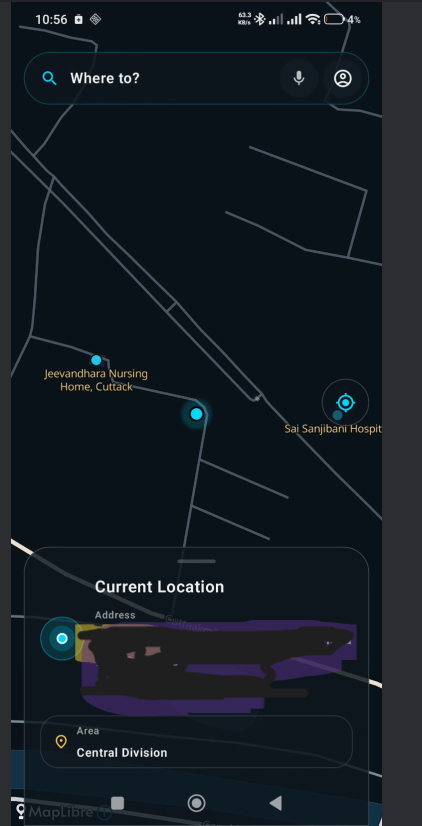
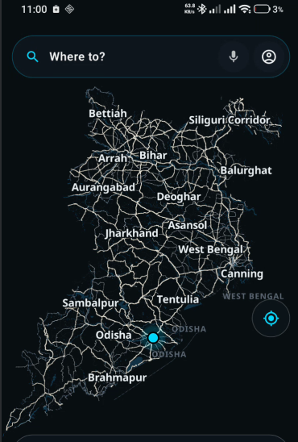
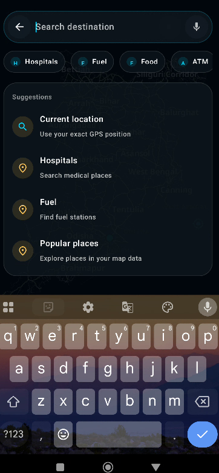
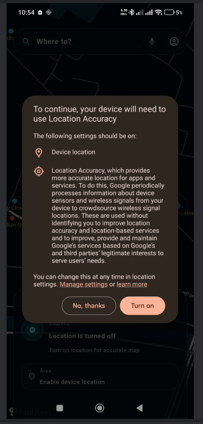

# Pupumap MapLibre Compose Starter

Pupumap MapLibre Compose Starter is an open-source Android starter project for building custom map-based user interfaces using **Kotlin**, **Jetpack Compose**, and **MapLibre**.

The goal of this project is to help Android developers understand how to structure a modern map UI with clean Compose components, location permission handling, user-location display, and customizable map overlays.

This project is currently focused on the Android frontend and map UI foundation.

---

## Screenshots

### Main Map Screen



### Map Overlay



### Search Destination



### Location Accuracy Prompt



---

## Features

* Kotlin-based Android project
* Jetpack Compose UI structure
* Map screen foundation
* MapLibre Android integration
* Location permission flow
* User location UI concept
* Custom search bar UI
* Floating location action button
* Bottom information card layout
* Dark map UI direction
* Clean project structure for map-based apps
* Starter design for custom map overlays

---

## Why this project exists

Building a map-based Android app can be confusing for beginners because the UI, permissions, location logic, map rendering, and project structure are often mixed together.

This project provides a simple starting point for developers who want to build their own custom map experience using open map technology and modern Android development practices.

The project is designed to be understandable, customizable, and useful for learning how map-based Android applications can be structured.

---

## Tech Stack

* Kotlin
* Jetpack Compose
* Android Studio
* Gradle Kotlin DSL
* MapLibre Android SDK
* Android Location Permission APIs

---

## Project Structure

```text
pupumap-maplibre-compose-starter/
├── android/
│   └── Android app source code
│
├── backend/
│   └── Optional backend experiments / future API work
│
├── database/
│   └── Optional database setup files
│
├── docker/
│   └── Optional local development setup
│
├── docs/
│   └── screenshots/
│       ├── map-screen.png
│       ├── map-overlay.png
│       ├── search-destination.png
│       └── location-accuracy-prompt.png
│
├── map-data/
│   └── Optional local map data experiments
│
└── scripts/
    └── Utility scripts
```

---

## Current Status

This project is in early development.

The current focus is:

* Android map UI foundation
* MapLibre screen setup
* Location permission handling
* Custom Compose-based map overlay design
* Clean project organization

More reusable map UI components, documentation, and examples will be added over time.

---

## Planned Improvements

* Reusable map search bar component
* Place bottom sheet component
* Floating location action button
* Custom marker UI
* Map style documentation
* Sample fake place data
* Screenshot-based usage guide
* Optional backend example
* PostGIS setup notes
* More Compose UI components for map apps
* Better documentation for beginners

---

## Who this project is for

This project is useful for:

* Android developers learning MapLibre
* Developers building map-based Compose apps
* Students experimenting with location-based app UI
* Open-source contributors interested in Android map interfaces
* Beginners who want to understand map app structure
* Developers who want a starting point for custom map UI

---

## Getting Started

### Requirements

* Android Studio
* Kotlin support
* Gradle
* Android device or emulator
* Internet connection for loading map resources

### Clone the repository

```bash
git clone https://github.com/subhamsarangi1598/pupumap-maplibre-compose-starter.git
```

### Open in Android Studio

1. Open Android Studio.
2. Select **Open Project**.
3. Choose the Android project folder.
4. Let Gradle sync.
5. Run the app on an emulator or physical Android device.

---

## Important Note

This project is a starter project and is not a finished navigation product.

It is intended for learning, experimentation, and building custom map UI foundations using Kotlin, Jetpack Compose, and MapLibre.

---

## Privacy and Safety

The screenshots and sample UI should not include private addresses, personal locations, real user data, API keys, database passwords, or production secrets.

Before publishing screenshots or code, always remove:

* Real addresses
* Exact coordinates
* Private locations
* API keys
* Database credentials
* Server passwords
* Personal data

---

## Contributing

Contributions are welcome.

Good contribution ideas include:

* Improving documentation
* Adding reusable Compose map components
* Improving UI structure
* Adding sample fake place data
* Fixing bugs
* Improving beginner setup instructions
* Adding screenshots or usage examples

---

## License

This project is released under the MIT License.

See the `LICENSE` file for details.
